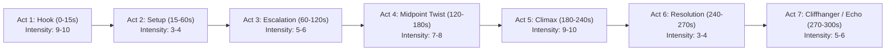

# High-Retention Documentary Storytelling & Hook Engineering (`STORY_RULES.md`)

This guide establishes the mandatory narrative architecture, psychological hook formulas, pacing metrics, and script schemas for the autonomous documentary video pipeline. Every generated script must strictly conform to these rules.

---

## 1. The 5–8 Second Cold-Open Hook

The first 8 seconds determine over 70% of viewer retention. **Never open chronologically** (e.g. "In 1959, in a small town...", "Welcome back to the channel..."). Open *in media res* at the most shocking, baffling, or catastrophic moment.

### The 5 High-Converting Hook Archetypes:

1. **The Inverted Climax (The Catastrophe First)**:
   > *"At 11:03 PM, nine experienced mountaineers sliced through their own tent from the inside... and ran barefoot into negative thirty-degree snow. What they were fleeing wasn't human."*
   - *Case Study*: Dyatlov Pass investigations, Lemmino's Flight MH370.

2. **The Declassified Anomaly**:
   > *"For thirty-three years, this Soviet military dossier was marked 'Top Secret.' When it was finally leaked, intelligence officials noticed that three pages were physically cut out with a razor blade."*
   - *Case Study*: Secret aerospace disasters, Cold War espionage records.

3. **The Fatal Reversal (The Illusion of Perfection)**:
   > *"He was the most celebrated cryptographer in modern history. But on a Tuesday afternoon in Zurich, a single handwritten postcard destroyed his entire $400 million empire."*
   - *Case Study*: MagnatesMedia corporate collapses, high-stakes true crime.

4. **The Impossible Paradox (Violation of Natural Law)**:
   > *"Five combat aircraft took off in clear weather. Two hours later, twenty-seven men vanished without transmitting a distress call—and the rescue plane sent to find them disappeared twenty minutes later."*
   - *Case Study*: Bermuda Triangle Flight 19, naval vanishings.

5. **The Existential Dilemma / Provocation**:
   > *"If you were trapped 8,000 meters above sea level and your oxygen gauge read zero, who would you betray first: your guide, or your brother?"*
   - *Case Study*: High-altitude mountaineering survival, extreme isolation crises.

---

## 2. Universal 7-Act Script Structure

Every documentary must follow this 7-act progression, calibrated for high retention and narrative drive:



1. **Act 1: The Cold Hook (0–15s)**: In media res opening, immediate anomaly, macro-loop opened.
2. **Act 2: The Setup & Status Quo (15–60s)**: Establish baseline reality, key players, initial mission.
3. **Act 3: The Escalation & First Failure (60–120s)**: Emerging obstacles, early signs that something is deeply wrong, meso-loop opened.
4. **Act 4: The Midpoint Twist & Reversal (120–180s)**: Discovery of the fatal clue, betrayal, or anomaly that invalidates the initial premise.
5. **Act 5: The Climax & Collapse (180–240s)**: Maximum tension, rapid cuts, critical failure point, resolution of the physical event.
6. **Act 6: Forensic Resolution (240–270s)**: Declassified revelations, evidence analysis, closure of the macro-loop.
7. **Act 7: The Lingering Echo / Cliffhanger (270–300s)**: Unanswered questions, chilling implications for the modern day, final open loop.

---

## 3. The 1–10 Narrative Intensity Scale

Visual duration, cut frequency, camera motion, and audio design are strictly mapped to segment intensity:

| Intensity Band | Narrative Function | Target Shot Length | Allowable Duration Range | Primary Camera Motion | Music Bed & Ducking Behavior |
| :---: | :--- | :---: | :---: | :--- | :--- |
| **1 – 2** | **Reflection / Somber Aftermath** | 6.5s | 5.0s – 8.0s | Subtle drift (1.02x scale) | Somber drone, ducked -26dB under dialogue |
| **3 – 4** | **Exposition / Archival Context** | 4.5s | 3.5s – 5.5s | Lateral pan across documents | Steady ambient bed, ducked -20dB |
| **5 – 6** | **Investigation / Emerging Clue** | 3.2s | 2.5s – 4.0s | Focused zoom-in (1.0 to 1.15x) | Cello / rhythmic pulse, ducked -22dB |
| **7 – 8** | **Escalation / Approaching Crisis** | 2.2s | 1.6s – 2.8s | Dynamic pan & zoom alternating | Urgent rhythmic pulse, riser SFX, +3dB swell |
| **9 – 10** | **Cold Hook / Climax / Reversal** | 1.4s | 1.0s – 1.8s | Punch zoom (1.18x) & jump cut | 400ms sound vacuum before impact braam sting |

---

## 4. Open-Loop Chaining Rules (The Zeigarnik Engine)

To prevent retention drop-offs between scenes:
1. **The Macro Loop (The Central Enigma)**: Planted within seconds 0–15; remains unanswered until Act 6.
2. **The Meso Loops (Act-Level Twists)**: Planted at the start of an act; resolved 45–60 seconds later.
3. **The Micro Loops (Scene Bridges)**: Never close an old scene loop without simultaneously planting the seed of the next mystery. End scenes on forward-leaning questions:
   - *"He believed the storm was passing. He was dead wrong."*
   - *"What the sonar detected beneath the hull shouldn't have existed."*
4. **The Zeigarnik Chaining Rule**: The resolution of a clue must immediately trigger a larger contradiction.

---

## 5. Pacing & Stake Escalation Cadence

- **Escalation Frequency**: Stakes must escalate every **30 to 45 seconds**. If a scene exceeds 45 seconds without introducing a new risk, conflict, or piece of evidence, viewer fatigue accelerates exponentially.
- **Micro-Cliffhangers**: Place a micro-cliffhanger or sudden tone shift immediately preceding major act breaks and visual transitions.
- **Sound Vacuum Deployment**: Apply a 400ms complete audio silence (`<break time="400ms"/>`) before every punch-zoom reveal or climax impact braam.

---

## 6. Performance Narration: SSML Prosody Specifications

Flat robotic reading destroys viewer immersion. Script scenes must encode SSML performance tags:
- **Dread / Ominous**: `<prosody rate="-12%" pitch="-4Hz">...</prosody>`
- **Twist / Revelation**: `<prosody rate="+6%" pitch="+2Hz"><emphasis level="strong">...</emphasis></prosody>`
- **Deliberate Hesitation**: `<break time="500ms"/>` before crucial proper nouns or shocking numbers.

---

## 7. Standard Script Schema Definition

```json
{
  "topic": "The Lost Cosmonaut",
  "central_open_loop": "Who was the phantom voice recorded orbiting Earth days before Gagarin's launch?",
  "acts": [
    {
      "act_number": 1,
      "act_name": "The Cold-Open Hook",
      "scenes": [
        {
          "scene_id": "act1_s1",
          "intensity": 9,
          "emotional_tag": "tension",
          "narration": "In May of 1961, two Italian radio operators intercepted an agonizing SOS transmission from high orbit.",
          "ssml_narration": "<speak><prosody rate=\"-10%\" pitch=\"-4Hz\">In May of 1961, two Italian radio operators intercepted an agonizing SOS transmission from high orbit.</prosody> <break time=\"500ms\"/> <prosody rate=\"+5%\" pitch=\"+2Hz\"><emphasis level=\"strong\">The Soviet Union denied anyone was up there.</emphasis></prosody></speak>",
          "visual_prompt": "Vintage 1960s radio listening station, glowing vacuum tubes, oscilloscope waveforms, dark espionage lighting",
          "broll_keywords": ["radio operator headphones", "oscilloscope green wave", "vintage soviet antenna"],
          "motion": "zoom_punch",
          "sfx": ["whoosh", "deep_braam"]
        }
      ]
    }
  ]
}
```
